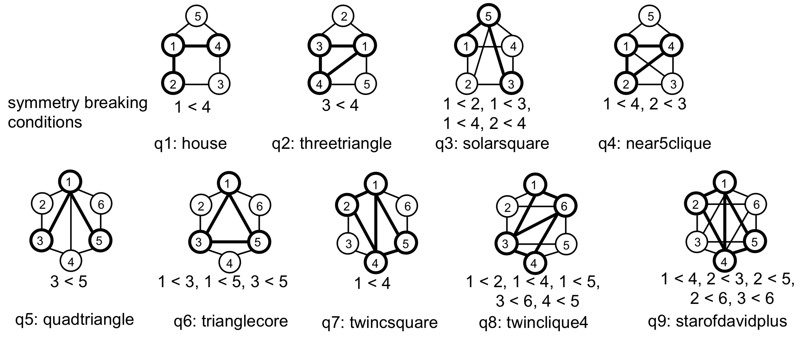

## Introduction

This repository holds the source code for the [paper](<https://ieeexplore.ieee.org/stamp/stamp.jsp?tp=&arnumber=8731551>) "BENU: Distributed Subgraph Enumeration with Backtracking-based Framework".

There are two independent projects:

- `code/Enumeration`: the implementation for BENU framework.
- `code/ExecutionPlanGeneration`: the code to generate the best execution plan for a given pattern graph.

## Prerequisite

1. The source codes are implemented with Hadoop 2.7.2, compiled with JDK 1.8. We store the data graph in HBase 1.2.6. To run the source codes, please install and configure [Apache Hadoop](<https://hadoop.apache.org/>) and [Apache HBase](<https://hbase.apache.org/>) in advance.
2. We use Maven to build the project. To download and install Maven, please refer to [Apache Maven](<https://maven.apache.org/>).

### Hadoop Configuration

There are some configuration items in `mapred-site.xml` that should be adjusted to run BENU smoothly.

Put the system's jar first in the classpath. This is necessary to avoid the version conflict of the  Netty library in the user's jar to connect to the HBase.

	```
	<property>
		<name>mapreduce.job.user.classpath.first</name>
		<value>false</value>
	</property>
	```

Since BENU starts only one reducer on each node, the reducer will require almost all the available memory. Therefore, you may need to modify the `yarn-site.xml` to make a MapReduce task can use the whole available memory.

```
<property>
                <name>yarn.nodemanager.resource.memory-mb</name>
                <value>*Memory space allocated for MapReduce*</value>
</property>

<property>
                <name>yarn.scheduler.minimum-allocation-mb</name>
                <value>1024</value>
</property>

<property>
                <name>yarn.scheduler.maximum-allocation-mb</name>
                <value>*The same as yarn.nodemanager.resource.memory-mb*</value>
</property>
<property>
                <name>yarn.nodemanager.resource.cpu-vcores</name>
                <value>*Number of physical cores of each node*</value>
</property>
```

### HBase Configuration

Increase the heap size of HBase to achieve higher performance of HBase. In our environment, we allocate 5Gbytes memory for HBase's heap.

```
# hbase-env.sh
export HBASE_HEAPSIZE=5G
```

## Compile

### Install Dependency

Before compiling the source codes, please compile and locally install our database client `kvstore-interface` in the directory `lib`.

```
mvn package
mvn install
```

### Compile Project

Go to the root directory of the project(`code/Enumeration/` or `code/ExecutionPlanGeneration/`) and run `mvn package` to compile the source code. Then you can see the jar file located under the target directory: 

- For Enumeration, the jar file is `target/SubgraphEnumeration-1-allinone.jar`.
- For ExecutionPlanGeneration, the jar file is `target/ExecutionPlanGeneration-1.0-SNAPSHOT.jar`.

We have already provided two jar files in the current directory.

## Subgraph Enumeration

### Prepare Data Graph 

The data graph files should be in the adjacency list format. Each line of the file starts with a source vertex `src_vid` following with its adjacency list separated by space, as shown below

```
src_vid neighbor_vid_1 neighbor_vid_2 ... neighbor_vid_n
```

The vertex IDs in adjacency lists should be sorted in the ascending order by their IDs.

In our experiments, vertex IDs in a data graph are consecutively numbered starting from 1. And we reorder the vertex IDs according to their degrees. If a node has a smaller degree, it has a smaller ID.

The data graph files should be stored in a directory on HDFS in advance. To generate enough parallelism, the data graph files should be splitted into N files in advance, where N is the number of available mappers in the Hadoop cluster (for example, 1 mapper per core).

### Prepare HBase Connection File

The program requires a connection file for HBase. We provide a default configuration file: `pasa.conf.prop`. This file gives several default configurations used in the program. You may need to change some configurations.

A demo file is shown below.

```
cache.capacity.gb=30
hbase.zookeeper.quorum=slave001,slave002,slave003
hbase.num.region=64
hbase.use.hashed.key=true
num.local.hbase.clients=12
```

1. `cache.capacity.gb`, the capacity of the local database cache measured in gigabytes. Assume each computing node has M gigabytes free memory after the OS starting up. Reserving 5GBytes for YARN/HDFS, 5GBytes for HBase and 1GBytes for each core, the remaining memory can be allocated to the local database cache.
2. `hbase.zookeeper.quorum`, the list of nodes configured as zookeeper quorum.
3. `hbase.num.region`, number of HBase regions of the table to store the adjacency lists. Recommend: 4 * N, N is the number of hbase region servers.
4. `hbase.use.hashed.key`, should always be `true` to guarantee the load balance.
5. `num.local.hbase.clients`, the number of local hbase clients. Recommend: number of cores in each computing node.

**Notice**: 
- The cores in each computing node mentioned above means the **hardware cores** in each node. If the OS reports the node having 24 cores under the hyperthreading technique, it only has 12 hardware cores.

- The file name `pasa.conf.prop` should not be changed. The file should always be in the same directory as the running script.

### Running Script

We provide a script file `run_query.sh` to run the program. This script accepts two parameters: the data graph directory in HDFS, and the pattern graph name. 

We provide codes for 9 pattern graphs in Fig.1. To enumerating subgraphs for the pattern graph `quadtriangle`, run the following command:

```
./run_query.sh data_graph_hdfs_dir quadtriangle
```



<center>Figure 1. Pattern Graphs</center>

This script gives several default configurations used in the program. The key configurations that need to be modified according to your environment are: 

- `MEMORY_LIMIT_IN_GB`: the available memory for each node after reserving space for Yarn/HDFS/HBase.
- `THREAD_NUM`: 2 * haredware cores per node.
- `EXECUTORS_NUM`: number of available computing nodes in the cluster.
- `timeout`: the timeout threshold, `2h` means two hours.
- `mapreduce.map.memory.mb`: default = 4096MB.
- mapreduce.reduce.memory.mb: recommend to use all the available memory of each node after reserving memory for Yarn/HDFS and HBase. 
- `mapreduce.reduce.cpu.vcores`: recommend to use the value of the hardware cores of each machine.
- `mapreduce.task.timeout`: the timeout threshold in second.
- `mapreduce.reduce.java.opts`: recommend to set the maximum heap size to mapreduce.reduce.memory.mb * 0.9.

The following configurations are recommended to use default value: 

- `output.path`: default = null. output.path = null means the statistics for vertex tasks won't be output. If you want to output the statistics, set output.path to your output path in HDFS.
- `enable.enumerate`: default = false. enable.enumerate = false means the subgraph matching results will be computed in a compressed version. If you want to count the complete results, set enable.enumerate = true.
- `enable.load.balance`: default = true. enable.load.balance=true means the task splitting optimization will be turned on. 
- `load.balance.threshold`: default = 500. The threshold for task splitting technique, only available when enable.load.balance=true. If the workload is skewed, you can decrease this value to balance the workload.
- `blocking.queue.size`: default = 100. The batch size for processing data graph and storing it in HBase.
- `store.graph.to.db`: default = false. store.graph.to.db = false means that the data graph won't be stored in the database in the map phase. store.graph.to.db = true means the data graph will be stored into HBase in the map phase. When you process a data graph for the first time, you should set this to `true` to store the data graph into database. When you process other pattern graphs with the same data graph, you can set this to `false`.

### Results

If you turn on the output, the output will be the statistics of the task execution.

The number of founded embeddings is reported in the counter part of the output as `embeddings.num`.

If `enable.enumerate = false` in the script file `run_query.sh`, the compression is turned on, the number of embeddings is the number of the compressed results. 

If you want to count the complete results, set `enable.enumerate = true`.

```
 Result
                computeTime(ns)=0
                dbAccessTime(ns)=0
                embeddings.num=553623708132
                serialExecutionTime(ns)=26373745345530
                vertex.num=1703750
```

## Execution Plan Generation

Run the following command to generate the best execution plan for a given pattern graph:

```
java -cp ExecutionPlanGeneration-1.0-SNAPSHOT.jar cn.edu.nju.pasa.graph.plangen.RunMe test_datagraph 10000 patterngraph
```

The program accepts three parameters: a test data graph file path(`test_datagraph`), the number of vertices in the test data graph file and a pattern graph file path(`patterngraph`).

### test_datagraph

This is a test data graph file for estimating execution plan costs with the following format, which is consistent with the above data graph file in HDFS:

```
src_vid neighbor_vid_1 neighbor_vid_2 ... neighbor_vid_n
```

You can replace it with any other data graph. Note that different data graphs may generate different execution plans due to the degree distribution. 

In the experiments in the ICDE paper, we use the provided test_datagraph to generate the execution plans for all the pattern graphs.

### Pattern graph

This is a given pattern graph with the following format:

1. first line: `n m k`
	- n: number of vertices
	- m: number of edges
	- k: number of symmetry breaking conditions.
2. followed by m lines, each line: `x y`
	- an undirected edge (x,y)
3. followed by k lines, each line: `a b`
	- provide a symmetry breaking condition `a < b`.

**Notice**: The vertex IDs must be consecutively numbered starting from 1.

For example, the pattern graph file for the `quadtriangle` in Fig. 1 is:

```
6 9 1
1 2
1 3
1 4
1 5
1 6
2 3
3 4
4 5
5 6
3 5
```

### Results

The generated execution plan is printed to the output.

```
Final Optimal Execution Plan
---------------------------------------------------
f1:=Init(start)
A1:=GetAdj(f1) | SIZE>=5
C3:=Intersect(A1)
f3:=Foreach(C3)
C5:=Intersect(A1) | >f3
A3:=GetAdj(f3) | SIZE>=3
T7:=TCache(f1,f3,A1,A3) | SIZE>=2
f5:=Foreach(C5)
C2:=Intersect(T7) | ≠f5
A5:=GetAdj(f5) | SIZE>=3
T6:=TCache(f1,f5,A1,A5) | SIZE>=2
T4:=Intersect(T7,A5)
f2:=Foreach(C2)
C6:=Intersect(T6) | ≠f2,≠f3
f6:=Foreach(C6)
C4:=Intersect(T4) | ≠f2,≠f6
f4:=Foreach(C4)
f:=ReportMatch(f1,f2,f3,f4,f5,f6)
```

The `SIZE>=X` is a filtering condition that the size of the target variable set should be equal or greater than `X`.


