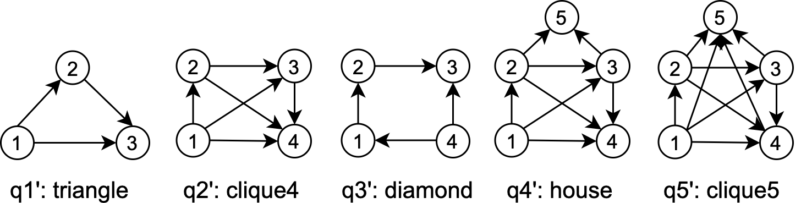

## Introduction

This repository holds the source code for the distributed continuous subgraph enumeration framework **S-BENU**(a streaming variant of  [**BENU**](<https://ieeexplore.ieee.org/stamp/stamp.jsp?tp=&arnumber=8731551>)) to solve the continuous subgraph enumeration problem on dynamic data graphs.

There are two independent projects:

- `code/Enumeration`: the implementation for S-BENU framework.
- `code/ExecutionPlanGeneration`: the code to generate the best incremental execution plans for a given pattern graph.

## Prerequisite

1. The source codes are implemented with Spark 2.2.0, compiled with JDK 1.8. We store the data graph in HBase 1.2.6. To run the source codes, please install and configure [Apache Spark](<https://spark.apache.org/>) and [Apache HBase](<https://hbase.apache.org/>) in advance.
2. We use Maven to build the project. To download and install Maven, please refer to [Apache Maven](<https://maven.apache.org/>).

### HBase Configuration

Increase the heap size of HBase to achieve higher performance of HBase. In our environment, we allocate 5Gbytes memory for HBase's heap.

```
# hbase-env.sh
export HBASE_HEAPSIZE=5G
```

## Compile

### Install Dependency

Before compiling the source codes, please compile and locally install our database client `kvstore-interface` in the directory `lib`.

```
mvn package
mvn install
```

### Compile Project

Go to the root directory of the project(`code/Enumeration/` or `code/ExecutionPlanGeneration/`) and run `mvn package` to compile the source code. Then you can see the jar file located under the target directory: 

- For Enumeration, the jar file is `target/SubgraphEnumeration-1-allinone.jar`.
- For ExecutionPlanGeneration, the jar file is `target/ExecutionPlanGeneration-1.0-SNAPSHOT.jar`.

We have already provided two jar files in the current directory.

## Continuous Subgraph Enumeration

### Prepare Initial Data Graph 

The initial data graph files include two files: the outgoing adjacency list file and the incoming adjacency list file.

The data graph files should be in the adjacency list format. Each line of the file starts with a vertex `src_vid`/`dst_vid` following with its outgoing/incoming adjacency list separated by space.

The outgoing adjacency list file is shown below:

```
src_vid dst_vid_1 dst_vid_2 ... dst_vid_n
```

The incoming adjacency list file is shown below:

```
dst_vid src_vid_1 src_vid_2 ... src_vid_n
```

The data graph files should be stored in a directory on HDFS in advance. 

### Prepare Update Edges Files

An update edges file is a batch update operations which consists of the edge insertion/deletion operations. Each line of the file is a source vertex `src_vid`, a destination vertex `dst_vid` and an operation `1`/`-1`, indicating inserting/deleting the edge (`src_vid`, `dst_vid`), as shown below:

```
src_vid_1 dst_vid_1 1
src_vid_2 dst_vid_2 -1
...
```

Assume there are $t(t\ge1)$ time steps, there should be *t* update edges files. Each file is a batch update operations $\Delta o_t​$ between time step *t* and *t* − 1. The program will read every update edges file and report positive and negative matches caused by update edges. 

The update edges files should be stored in a directory on HDFS in advance.

**Notice**: 

We assume that an edge is either inserted or deleted in each update edges file. The inserted edges in each update edges file $\Delta o_t$ must exist at time step t-1, and the deleted edges in each update edges file $\Delta o_t$ must not exist at time step t-1.

### Prepare HBase Connection File

The program requires a connection file for HBase. We provide a default configuration file: `pasa.conf.prop`. This file gives several default configurations used in the program. You may need to change some configurations.

A demo file is shown below:

```
cache.capacity.gb=30
hbase.zookeeper.quorum=slave001,slave002,slave003
hbase.num.region=64
hbase.use.hashed.key=true
num.local.hbase.clients=12
```

1. `cache.capacity.gb`, the capacity of the local database cache measured in gigabytes. Assume each computing node has M gigabytes free memory after the OS starting up. Reserving 5GBytes for HDFS, 5GBytes for HBase and 1GBytes for each core, the remaining memory can be allocated to the local database cache.
2. `hbase.zookeeper.quorum`, the list of nodes configured as zookeeper quorum.
3. `hbase.num.region`, number of HBase regions of the table to store the adjacency lists. Recommend: 4 * N, N is the number of hbase region servers.
4. `hbase.use.hashed.key`, should always be `true` to guarantee the load balance.
5. `num.local.hbase.clients`, the number of local hbase clients. Recommend: number of cores in each computing node.

**Notice**: 

- The cores in each computing node mentioned above means the **hardware cores** in each node. If the OS reports the node having 24 cores under the hyperthreading technique, it only has 12 hardware cores.

- The file name `pasa.conf.prop` should not be changed. The file should always be in the same directory as the running script.

### Running Script

We provide a script file `run_query_spark.sh` to run the program. This script accepts five parameters: the outgoing adjacency list directory in HDFS for the initial data graph, the incoming adjacency list directory in HDFS for the initial data graph, the incremental execution plans directory, the update edges directory in HDFS, and total time step. 

We provide incremental execution plans for 5 pattern graphs in Fig.1 in `plans` directory. To enumerating all positive and negative subgraphs for the pattern graph `triangle` within time step 10, run the following command:

```
./run_query_spark.sh outgoing_adjacency_list_hdfs_dir incoming_adjacency_list_hdfs_dir plans/triangle update_edges_hdfs_dir 10 
```



<center>Figure 1. Pattern Graphs</center>

**Notice**: Assume the total time step is *t*, the number of files in the update edges directory is *n*. if $t\le n$,  the program will run *t* time steps, otherwise, the program will only run *n* time steps.

This script gives several default configurations used in the program. The key configurations that need to be modified according to your environment are: 

- `master`: specifies the master URL for a distributed cluster, or `local` to run locally with one thread, or `local[N]` to run locally with N threads. We  run the program on [Hadoop YARN](<https://spark.apache.org/docs/latest/running-on-yarn.html>).
- `driver-memory`: recommend to use all the available memory of each node after reserving memory for HDFS and HBase. 
- `executor-memory`: recommend to use all the available memory of each node after reserving memory for HDFS and HBase. 
- `num-executors`: number of available computing nodes in the cluster.
- `partition.num`: number of available computing nodes* haredware cores per node * 2 * 2.

The following configurations are recommended to use default value: 

- `output.path`: default = null. output.path = null means the positive and negative matching results for every time step won't be output. If you want to output the matches, set output.path to your output path in HDFS.
- `blocking.queue.size`: default = 1000. The batch size for processing initial data graph and storing it in HBase.
- `enable.load.balance`: default = false. enable.load.balance=false means the task splitting optimization will be turned off. 
- `load.balance.threshold`: default = 50. The threshold for task splitting technique, only available when enable.load.balance=true. If the workload is skewed, you can decrease this value to balance the workload.

### Results

If you turn on the output, the output will be the positive and negative matches for every time step.

The number of founded positive and negative matches  for every time step is reported in the output on the console as `Delta embeddings num`.

```
---------------- Timestamp 1----------------
update edges file: hdfs://slave001:9001//user/experiment/huweiwei/ldbc_snb_datagen/graphalytics1000/initial_0.2/updates/20000/part-r-00000
Store the update edges...
Enumerate...
Delta embeddings num: 88591
Delta vertex num: 19449
Vertex task num: 58347
Serial Execution Time(ns): 138977579661
Merge delta adjs...
Timestamp 1 consumes 6.10 seconds to process.
---------------- Timestamp 2----------------
...
```

## Execution Plan Generation

Run the following command to generate the best incremental execution plans for a given pattern graph:

```
java -cp ExecutionPlanGeneration-1.0-SNAPSHOT.jar cn.edu.nju.pasa.graph.plangen.incremental.RunMe test_datagraph 10000 patterngraph
```

The program accepts three parameters: a test data graph file path(`test_datagraph`), the number of vertices in the test data graph file and a pattern graph file path(`patterngraph`).

### test_datagraph

This is a test data graph file for estimating incremental execution plan costs. When S-BENU estimates the number of matching results, it turns incremental partial pattern graphs into undirected ones and ignores types on edges. Therefore, the provided test data graph is also undirected. Each line of the file starts with a source vertex `src_vid` following with its adjacency list separated by space, as shown below:

```
src_vid neighbor_vid_1 neighbor_vid_2 ... neighbor_vid_n
```

You can replace it with any other data graph. Note that different data graphs may generate different incremental execution plans due to the degree distribution. 

In the experiments in the S-BENU, we use the provided test_datagraph to generate the incremental execution plans for all the pattern graphs.

### Pattern graph

This is a given pattern graph with the following format:

1. first line: `n m k`
	- n: number of vertices
	- m: number of edges
	- k: number of symmetry breaking conditions. 
2. followed by m lines, each line: `x y`
	- a directed edge (x,y)
3. followed by k lines, each line: `a b`
	- provide a symmetry breaking condition `a < b`.

**Notice**: The vertex IDs must be consecutively numbered starting from 1.

For example, the pattern graph file for the `triangle` in Fig. 1 is:

```
3 3 0
1 2
1 3
2 3
```

### Results

The generated incremental execution plans is printed to the output.

```
Delta edge: (1, 2)
Final Optimal Execution Plan
---------------------------------------------------
f1:=Init(start)
ADO1:=GetAdj(f1,delta,out)
op,f2:=Foreach(ADO1)
AUO1:=GetAdj(f1,unaltered,out,op)
AUO2:=GetAdj(f2,unaltered,out,op)
T3:=Intersect(AUO1,AUO2)
f3:=Foreach(T3)
f:=ReportMatch(f1,f2,f3)

Delta edge: (1, 3)
Final Optimal Execution Plan
---------------------------------------------------
f1:=Init(start)
ADO1:=GetAdj(f1,delta,out)
op,f3:=Foreach(ADO1)
AEO1:=GetAdj(f1,either,out,op)
AUI3:=GetAdj(f3,unaltered,in,op)
T2:=Intersect(AEO1,AUI3)
f2:=Foreach(T2)
f:=ReportMatch(f1,f2,f3)

Delta edge: (2, 3)
Final Optimal Execution Plan
---------------------------------------------------
f2:=Init(start)
ADO2:=GetAdj(f2,delta,out)
op,f3:=Foreach(ADO2)
AEI2:=GetAdj(f2,either,in,op)
AEI3:=GetAdj(f3,either,in,op)
T1:=Intersect(AEI2,AEI3)
f1:=Foreach(T1)
f:=ReportMatch(f1,f2,f3)
```


